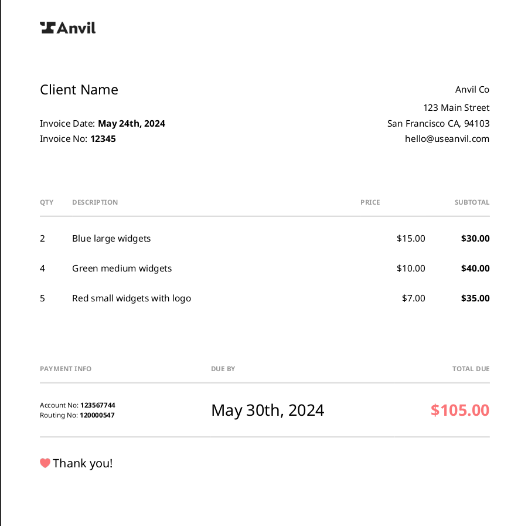

# Vue to PDF

These examples use Vue to generate an invoice PDF via
Anvil's [HTML to PDF API](https://www.useanvil.com/docs/api/generate-pdf#html--css-to-pdf). You can use this as a
jumping off point to generate a PDF with your own custom Vue components.

### minimal-app

This app uses the [Options API](https://vuejs.org/guide/introduction.html#api-styles) component style. Use this if you
do not use Vue's single-file components. This does not process any CSS, so CSS will need to be provided manually.

### full-sfc-support

This app uses Vue's single-file components (SFC) and uses their compiled CSS automatically.

NOTE: Vue's scoped styles (`<style scoped>`) are currently not supported with the Anvil PDF generation endpoint. Please
consider using other combinations of selectors for your styles.

### invoice-example

Same as the `full-sfc-support` app, however, it is a Vue-port of our [React invoice example](https://github.com/anvilco/html-pdf-invoice-template/tree/main/react-pdf).

Example output:



#### Usage

Whichever app you choose the usage is the same:

Install the dependencies:

```shell
npm install
# or
yarn install
```

Run the generate command:

```shell
ANVIL_API_KEY=YOUR_API_KEY npm run generate && open output.pdf
# or 
ANVIL_API_KEY=YOUR_API_KEY yarn generate && open output.pdf
```
